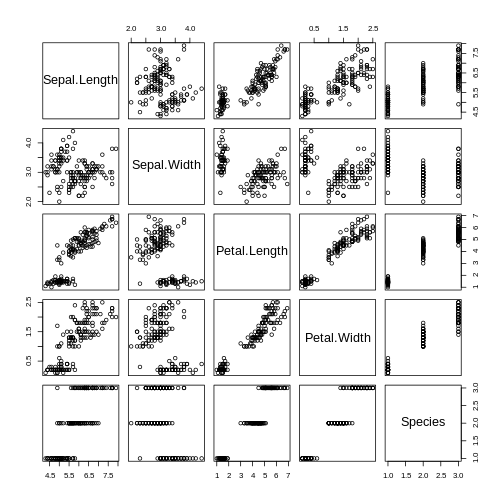
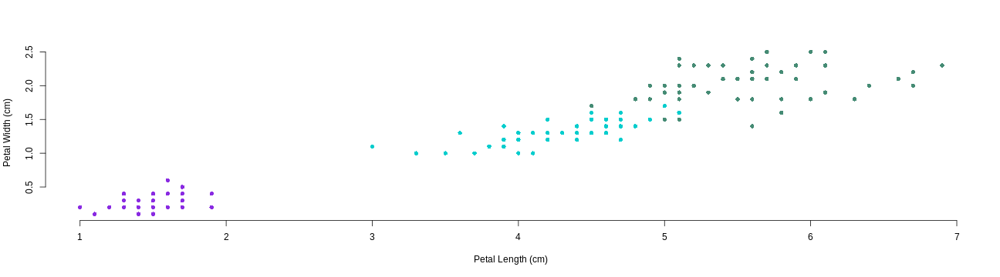

Iris dataset Prediciton modeling Application
========================================================
author: Georgios Tsagiannis (gtsa)
date: 24/01/2020
width: 1920
height: 1080

Basic Idea
========================================================

The basic idea was to try to present an interactive tool that, based on the iris dataset, would be able to predict the width of the sepals/petals given their corresponding length


```r
str(iris)
```

```
'data.frame':	150 obs. of  5 variables:
 $ Sepal.Length: num  5.1 4.9 4.7 4.6 5 5.4 4.6 5 4.4 4.9 ...
 $ Sepal.Width : num  3.5 3 3.2 3.1 3.6 3.9 3.4 3.4 2.9 3.1 ...
 $ Petal.Length: num  1.4 1.4 1.3 1.5 1.4 1.7 1.4 1.5 1.4 1.5 ...
 $ Petal.Width : num  0.2 0.2 0.2 0.2 0.2 0.4 0.3 0.2 0.2 0.1 ...
 $ Species     : Factor w/ 3 levels "setosa","versicolor",..: 1 1 1 1 1 1 1 1 1 1 ...
```
The dataset consists of 150 observations of 5 variables. Or else, it consists of 50 observations of three different iris' species (setosa, versicolor, virginica) of 4 variables.

Sepals-Petals & Length-Width
========================================================

These for variables are the length and the width of the sepals and the petals and in their different combinations they offer 6 different potential predicting models



Among them, for our application, the user can select only among two:

- Sepals Length ~ Sepals Width
- Petals Length ~ Petals Width


Three different species - 7 different options
========================================================
But the result of the prediction is also based on the observations that our user will use for its model. This model can be based on:

- 50 obs of **iris setosa**, 50 obs of **iris versicolor** or 50 obs of **iris virginica**
- 100 obs of **iris setosa** and **iris versicolor**, 100 obs of **iris setosa** and **iris virginica** or 100 obs of **iris versicolor** and **iris virginica**
- 150 obs of **all** three of them


```r
plot(iris$Petal.Length, iris$Petal.Width, xlab="Petal Length (cm)", ylab="Petal Width (cm)", bty="n", pch=16, col=ifelse(iris$Species=="setosa","blueviolet",ifelse(iris$Species=="versicolor", "cyan3", "aquamarine4")), xlim=c(min(iris$Petal.Length), max(iris$Petal.Length)), ylim=c(min(iris$Petal.Width), max(iris$Petal.Width)))
```



This is why...
========================================================

... we created a Shiny application where the user can choose among the 14 above options in order to obtain not only the corresponding model plot but also `—whether for sepals or petals`— a precise width prediction for a length input of their own choice.

- https://gtsa.shinyapps.io/Iris_App/
- https://github.com/gtsa/Shiny/tree/master/Iris_App

Thank you very much !!!!
